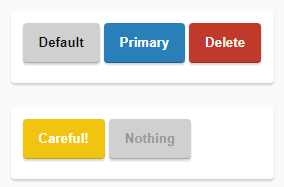

# Buttons

These are simple buttons with 3 states: Normal | Hovered | Clicked

## Optional Javascript

The javascript is only added to position the press effect right under the mouse click. The script is used to determine the actual position of the mouse when it clicks on the button. This adds a top and left position to the button using custom property `--coord-x` and `--coord-y`. This value is then processed in CSS using the CSS3 method `var()`

Note that the Javascript is optional and the experience should look good enough even without the animation.

You can see a live demo and a little more explanation on here: [Create Awesome CSS buttons](https://idiallo.com/blog/create-awesome-css-buttons).
